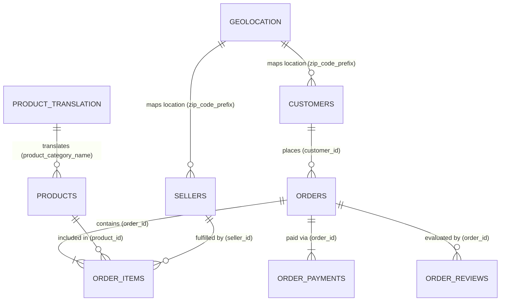

# RetailPulse Data Profiling & Schema Analysis Report

## Executive Summary
This data profiling report analyzes all **9 raw CSV datasets** located in `data/raw/` for the **RetailPulse** project (Brazilian E-Commerce Olist Dataset). The objective is to inspect schema structures, row counts, data types, missing value frequencies, duplicate records, primary key candidates, and cross-table foreign key relationships without altering raw data or initiating pipeline execution.

### Summary of Raw Datasets
| Filename | Row Count | Column Count | Duplicate Rows | Primary Key (PK) | Description |
| :--- | :---: | :---: | :---: | :--- | :--- |
| `olist_customers_dataset.csv` | 99,441 | 5 | 0 | `customer_id` | Customer details and location mapping per order |
| `olist_geolocation_dataset.csv` | 1,000,163 | 5 | 261,831 | Composite / Synthetic (`geolocation_zip_code_prefix`, `geolocation_lat`, `geolocation_lng`) | Brazilian zip codes with lat/lng coordinates |
| `olist_order_items_dataset.csv` | 112,650 | 7 | 0 | Composite (`order_id`, `order_item_id`) | Line items purchased in each order |
| `olist_order_payments_dataset.csv` | 103,886 | 5 | 0 | Composite (`order_id`, `payment_sequential`) | Payment breakdown and payment methods per order |
| `olist_order_reviews_dataset.csv` | 99,224 | 7 | 0 | Composite (`review_id`, `order_id`) | Customer review scores and commentary |
| `olist_orders_dataset.csv` | 99,441 | 8 | 0 | `order_id` | Core order entity with status and timestamps |
| `olist_products_dataset.csv` | 32,951 | 9 | 0 | `product_id` | Product catalog details, categories, and dimensions |
| `olist_sellers_dataset.csv` | 3,095 | 4 | 0 | `seller_id` | Seller registry and location details |
| `product_category_name_translation.csv` | 71 | 2 | 0 | `product_category_name` | Portuguese to English category translation lookup |

---

## Entity Relationship Diagram (ERD)

---

## Detailed File Profiling Reports

### 1. File: `olist_customers_dataset.csv`

- **File Name:** `olist_customers_dataset.csv`
- **Total Rows:** `99,441`
- **Total Columns:** `5`
- **Duplicate Rows:** `0` (0.0%)
- **Identified Primary Key:** `customer_id`
  - *PK Rationale:* `customer_id` is 100% unique (99,441 unique values across 99,441 rows) and acts as the key for each specific order context. Note that `customer_unique_id` (96,096 unique values) represents the actual unique person across multiple transactions.

#### Column Data Schema & Null Frequencies

| Column Name | Pandas Data Type | Missing Count | Missing % | Unique Count | Sample Values |
| :--- | :---: | :---: | :---: | :---: | :--- |
| `customer_id` | `object` | 0 | 0.0% | 99,441 | `06b8999e2fba1a1fbc88172c00ba8bc7`, `18955e83d337fd6b2def6b18a428ac77`, `4e7b3e00288586ebd08712fdd0374a03` |
| `customer_unique_id` | `object` | 0 | 0.0% | 96,096 | `861eff4711a542e4b93843c6dd7febb0`, `290c77bc529b7ac935b93aa66c333dc3`, `060e732b5b29e8181a18229c7b0b2b5e` |
| `customer_zip_code_prefix` | `int64` | 0 | 0.0% | 14,994 | `14409`, `9790`, `1151` |
| `customer_city` | `object` | 0 | 0.0% | 4,119 | `franca`, `sao bernardo do campo`, `sao paulo` |
| `customer_state` | `object` | 0 | 0.0% | 27 | `SP`, `SP`, `SP` |

#### Sample Records (Top 3 Rows)

| `customer_id` | `customer_unique_id` | `customer_zip_code_prefix` | `customer_city` | `customer_state` |
| :--- | :--- | :--- | :--- | :--- |
| 06b8999e2fba1a1fbc88172c00ba8bc7 | 861eff4711a542e4b93843c6dd7febb0 | 14409 | franca | SP |
| 18955e83d337fd6b2def6b18a428ac77 | 290c77bc529b7ac935b93aa66c333dc3 | 9790 | sao bernardo do campo | SP |
| 4e7b3e00288586ebd08712fdd0374a03 | 060e732b5b29e8181a18229c7b0b2b5e | 1151 | sao paulo | SP |

---

### 2. File: `olist_geolocation_dataset.csv`

- **File Name:** `olist_geolocation_dataset.csv`
- **Total Rows:** `1,000,163`
- **Total Columns:** `5`
- **Duplicate Rows:** `261,831` (26.18%)
- **Identified Primary Key:** Composite (`geolocation_zip_code_prefix`, `geolocation_lat`, `geolocation_lng`) / Synthetic Key
  - *PK Rationale:* Contains 261,831 exact duplicate rows and multiple coordinate entries per zip code prefix (19,015 unique zip codes). Pipeline deduplication and aggregation (e.g. median lat/lng per zip code prefix) is recommended.

#### Column Data Schema & Null Frequencies

| Column Name | Pandas Data Type | Missing Count | Missing % | Unique Count | Sample Values |
| :--- | :---: | :---: | :---: | :---: | :--- |
| `geolocation_zip_code_prefix` | `int64` | 0 | 0.0% | 19,015 | `1037`, `1046`, `1046` |
| `geolocation_lat` | `float64` | 0 | 0.0% | 717,360 | `-23.54562128115268`, `-23.54608112703553`, `-23.54612896641469` |
| `geolocation_lng` | `float64` | 0 | 0.0% | 717,613 | `-46.63929204800168`, `-46.64482029837157`, `-46.64295148361138` |
| `geolocation_city` | `object` | 0 | 0.0% | 8,011 | `sao paulo`, `sao paulo`, `sao paulo` |
| `geolocation_state` | `object` | 0 | 0.0% | 27 | `SP`, `SP`, `SP` |

#### Sample Records (Top 3 Rows)

| `geolocation_zip_code_prefix` | `geolocation_lat` | `geolocation_lng` | `geolocation_city` | `geolocation_state` |
| :--- | :--- | :--- | :--- | :--- |
| 1037 | -23.54562128115268 | -46.63929204800168 | sao paulo | SP |
| 1046 | -23.54608112703553 | -46.64482029837157 | sao paulo | SP |
| 1046 | -23.54612896641469 | -46.64295148361138 | sao paulo | SP |

---

### 3. File: `olist_order_items_dataset.csv`

- **File Name:** `olist_order_items_dataset.csv`
- **Total Rows:** `112,650`
- **Total Columns:** `7`
- **Duplicate Rows:** `0` (0.0%)
- **Identified Primary Key:** Composite (`order_id`, `order_item_id`)
  - *PK Rationale:* The combination of `order_id` and sequential `order_item_id` (1, 2, 3...) uniquely identifies each item line in an order (0 duplicate pairs across 112,650 rows).

#### Column Data Schema & Null Frequencies

| Column Name | Pandas Data Type | Missing Count | Missing % | Unique Count | Sample Values |
| :--- | :---: | :---: | :---: | :---: | :--- |
| `order_id` | `object` | 0 | 0.0% | 98,666 | `00010242fe8c5a6d1ba2dd792cb16214`, `00018f77f2f0320c557190d7a144bdd3`, `000229ec398224ef6ca0657da4fc703e` |
| `order_item_id` | `int64` | 0 | 0.0% | 21 | `1`, `1`, `1` |
| `product_id` | `object` | 0 | 0.0% | 32,951 | `4244733e06e7ecb4970a6e2683c13e61`, `e5f2d52b802189ee658865ca93d83a8f`, `c777355d18b72b67abbeef9df44fd0fd` |
| `seller_id` | `object` | 0 | 0.0% | 3,095 | `48436dade18ac8b2bce089ec2a041202`, `dd7ddc04e1b6c2c614352b383efe2d36`, `5b51032eddd242adc84c38acab88f23d` |
| `shipping_limit_date` | `object` | 0 | 0.0% | 93,318 | `2017-09-19 09:45:35`, `2017-05-03 11:05:13`, `2018-01-18 14:48:30` |
| `price` | `float64` | 0 | 0.0% | 5,968 | `58.9`, `239.9`, `199.0` |
| `freight_value` | `float64` | 0 | 0.0% | 6,999 | `13.29`, `19.93`, `17.87` |

#### Sample Records (Top 3 Rows)

| `order_id` | `order_item_id` | `product_id` | `seller_id` | `shipping_limit_date` | `price` | `freight_value` |
| :--- | :--- | :--- | :--- | :--- | :--- | :--- |
| 00010242fe8c5a6d1ba2dd792cb16214 | 1 | 4244733e06e7ecb4970a6e2683c13e61 | 48436dade18ac8b2bce089ec2a041202 | 2017-09-19 09:45:35 | 58.9 | 13.29 |
| 00018f77f2f0320c557190d7a144bdd3 | 1 | e5f2d52b802189ee658865ca93d83a8f | dd7ddc04e1b6c2c614352b383efe2d36 | 2017-05-03 11:05:13 | 239.9 | 19.93 |
| 000229ec398224ef6ca0657da4fc703e | 1 | c777355d18b72b67abbeef9df44fd0fd | 5b51032eddd242adc84c38acab88f23d | 2018-01-18 14:48:30 | 199.0 | 17.87 |

---

### 4. File: `olist_order_payments_dataset.csv`

- **File Name:** `olist_order_payments_dataset.csv`
- **Total Rows:** `103,886`
- **Total Columns:** `5`
- **Duplicate Rows:** `0` (0.0%)
- **Identified Primary Key:** Composite (`order_id`, `payment_sequential`)
  - *PK Rationale:* The pair (`order_id`, `payment_sequential`) uniquely identifies each payment attempt/installment for an order (0 duplicate pairs across 103,886 rows).

#### Column Data Schema & Null Frequencies

| Column Name | Pandas Data Type | Missing Count | Missing % | Unique Count | Sample Values |
| :--- | :---: | :---: | :---: | :---: | :--- |
| `order_id` | `object` | 0 | 0.0% | 99,440 | `b81ef226f3fe1789b1e8b2acac839d17`, `a9810da82917af2d9aefd1278f1dcfa0`, `25e8ea4e93396b6fa0d3dd708e76c1bd` |
| `payment_sequential` | `int64` | 0 | 0.0% | 29 | `1`, `1`, `1` |
| `payment_type` | `object` | 0 | 0.0% | 5 | `credit_card`, `credit_card`, `credit_card` |
| `payment_installments` | `int64` | 0 | 0.0% | 24 | `8`, `1`, `1` |
| `payment_value` | `float64` | 0 | 0.0% | 29,077 | `99.33`, `24.39`, `65.71` |

#### Sample Records (Top 3 Rows)

| `order_id` | `payment_sequential` | `payment_type` | `payment_installments` | `payment_value` |
| :--- | :--- | :--- | :--- | :--- |
| b81ef226f3fe1789b1e8b2acac839d17 | 1 | credit_card | 8 | 99.33 |
| a9810da82917af2d9aefd1278f1dcfa0 | 1 | credit_card | 1 | 24.39 |
| 25e8ea4e93396b6fa0d3dd708e76c1bd | 1 | credit_card | 1 | 65.71 |

---

### 5. File: `olist_order_reviews_dataset.csv`

- **File Name:** `olist_order_reviews_dataset.csv`
- **Total Rows:** `99,224`
- **Total Columns:** `7`
- **Duplicate Rows:** `0` (0.0%)
- **Identified Primary Key:** Composite (`review_id`, `order_id`)
  - *PK Rationale:* `review_id` alone has 98,410 unique values out of 99,224 rows because a single review can occasionally be linked to multiple orders or re-sent. The pair (`review_id`, `order_id`) is unique.

#### Column Data Schema & Null Frequencies

| Column Name | Pandas Data Type | Missing Count | Missing % | Unique Count | Sample Values |
| :--- | :---: | :---: | :---: | :---: | :--- |
| `review_id` | `object` | 0 | 0.0% | 98,410 | `7bc2406110b926393aa56f80a40eba40`, `80e641a11e56f04c1ad469d5645fdfde`, `228ce5500dc1d8e020d8d1322874b6f0` |
| `order_id` | `object` | 0 | 0.0% | 98,673 | `73fc7af87114b39712e6da79b0a377eb`, `a548910a1c6147796b98fdf73dbeba33`, `f9e4b658b201a9f2ecdecbb34bed034b` |
| `review_score` | `int64` | 0 | 0.0% | 5 | `4`, `5`, `5` |
| `review_comment_title` | `object` | 87,656 | 88.34% | 4,528 | `recomendo`, `Super recomendo`, `Não chegou meu produto ` |
| `review_comment_message` | `object` | 58,247 | 58.7% | 36,160 | `Recebi bem antes do prazo estipulado.`, `Parabéns lojas lannister adorei comprar pela Internet seguro e prático Parabéns a todos feliz Páscoa`, `aparelho eficiente. no site a marca do aparelho esta impresso como 3desinfector e ao chegar esta com outro nome...atualizar com a marca correta uma vez que é o mesmo aparelho` |
| `review_creation_date` | `object` | 0 | 0.0% | 636 | `2018-01-18 00:00:00`, `2018-03-10 00:00:00`, `2018-02-17 00:00:00` |
| `review_answer_timestamp` | `object` | 0 | 0.0% | 98,248 | `2018-01-18 21:46:59`, `2018-03-11 03:05:13`, `2018-02-18 14:36:24` |

#### Sample Records (Top 3 Rows)

| `review_id` | `order_id` | `review_score` | `review_comment_title` | `review_comment_message` | `review_creation_date` | `review_answer_timestamp` |
| :--- | :--- | :--- | :--- | :--- | :--- | :--- |
| 7bc2406110b926393aa56f80a40eba40 | 73fc7af87114b39712e6da79b0a377eb | 4 | *NULL* | *NULL* | 2018-01-18 00:00:00 | 2018-01-18 21:46:59 |
| 80e641a11e56f04c1ad469d5645fdfde | a548910a1c6147796b98fdf73dbeba33 | 5 | *NULL* | *NULL* | 2018-03-10 00:00:00 | 2018-03-11 03:05:13 |
| 228ce5500dc1d8e020d8d1322874b6f0 | f9e4b658b201a9f2ecdecbb34bed034b | 5 | *NULL* | *NULL* | 2018-02-17 00:00:00 | 2018-02-18 14:36:24 |

---

### 6. File: `olist_orders_dataset.csv`

- **File Name:** `olist_orders_dataset.csv`
- **Total Rows:** `99,441`
- **Total Columns:** `8`
- **Duplicate Rows:** `0` (0.0%)
- **Identified Primary Key:** `order_id`
  - *PK Rationale:* `order_id` is 100% unique (99,441 unique values across 99,441 rows) and serves as the central hub entity for items, payments, and reviews.

#### Column Data Schema & Null Frequencies

| Column Name | Pandas Data Type | Missing Count | Missing % | Unique Count | Sample Values |
| :--- | :---: | :---: | :---: | :---: | :--- |
| `order_id` | `object` | 0 | 0.0% | 99,441 | `e481f51cbdc54678b7cc49136f2d6af7`, `53cdb2fc8bc7dce0b6741e2150273451`, `47770eb9100c2d0c44946d9cf07ec65d` |
| `customer_id` | `object` | 0 | 0.0% | 99,441 | `9ef432eb6251297304e76186b10a928d`, `b0830fb4747a6c6d20dea0b8c802d7ef`, `41ce2a54c0b03bf3443c3d931a367089` |
| `order_status` | `object` | 0 | 0.0% | 8 | `delivered`, `delivered`, `delivered` |
| `order_purchase_timestamp` | `object` | 0 | 0.0% | 98,875 | `2017-10-02 10:56:33`, `2018-07-24 20:41:37`, `2018-08-08 08:38:49` |
| `order_approved_at` | `object` | 160 | 0.16% | 90,734 | `2017-10-02 11:07:15`, `2018-07-26 03:24:27`, `2018-08-08 08:55:23` |
| `order_delivered_carrier_date` | `object` | 1,783 | 1.79% | 81,019 | `2017-10-04 19:55:00`, `2018-07-26 14:31:00`, `2018-08-08 13:50:00` |
| `order_delivered_customer_date` | `object` | 2,965 | 2.98% | 95,665 | `2017-10-10 21:25:13`, `2018-08-07 15:27:45`, `2018-08-17 18:06:29` |
| `order_estimated_delivery_date` | `object` | 0 | 0.0% | 459 | `2017-10-18 00:00:00`, `2018-08-13 00:00:00`, `2018-09-04 00:00:00` |

#### Sample Records (Top 3 Rows)

| `order_id` | `customer_id` | `order_status` | `order_purchase_timestamp` | `order_approved_at` | `order_delivered_carrier_date` | `order_delivered_customer_date` | `order_estimated_delivery_date` |
| :--- | :--- | :--- | :--- | :--- | :--- | :--- | :--- |
| e481f51cbdc54678b7cc49136f2d6af7 | 9ef432eb6251297304e76186b10a928d | delivered | 2017-10-02 10:56:33 | 2017-10-02 11:07:15 | 2017-10-04 19:55:00 | 2017-10-10 21:25:13 | 2017-10-18 00:00:00 |
| 53cdb2fc8bc7dce0b6741e2150273451 | b0830fb4747a6c6d20dea0b8c802d7ef | delivered | 2018-07-24 20:41:37 | 2018-07-26 03:24:27 | 2018-07-26 14:31:00 | 2018-08-07 15:27:45 | 2018-08-13 00:00:00 |
| 47770eb9100c2d0c44946d9cf07ec65d | 41ce2a54c0b03bf3443c3d931a367089 | delivered | 2018-08-08 08:38:49 | 2018-08-08 08:55:23 | 2018-08-08 13:50:00 | 2018-08-17 18:06:29 | 2018-09-04 00:00:00 |

---

### 7. File: `olist_products_dataset.csv`

- **File Name:** `olist_products_dataset.csv`
- **Total Rows:** `32,951`
- **Total Columns:** `9`
- **Duplicate Rows:** `0` (0.0%)
- **Identified Primary Key:** `product_id`
  - *PK Rationale:* `product_id` is 100% unique (32,951 unique values across 32,951 rows) with zero duplicate records.

#### Column Data Schema & Null Frequencies

| Column Name | Pandas Data Type | Missing Count | Missing % | Unique Count | Sample Values |
| :--- | :---: | :---: | :---: | :---: | :--- |
| `product_id` | `object` | 0 | 0.0% | 32,951 | `1e9e8ef04dbcff4541ed26657ea517e5`, `3aa071139cb16b67ca9e5dea641aaa2f`, `96bd76ec8810374ed1b65e291975717f` |
| `product_category_name` | `object` | 610 | 1.85% | 74 | `perfumaria`, `artes`, `esporte_lazer` |
| `product_name_lenght` | `float64` | 610 | 1.85% | 67 | `40.0`, `44.0`, `46.0` |
| `product_description_lenght` | `float64` | 610 | 1.85% | 2,961 | `287.0`, `276.0`, `250.0` |
| `product_photos_qty` | `float64` | 610 | 1.85% | 20 | `1.0`, `1.0`, `1.0` |
| `product_weight_g` | `float64` | 2 | 0.01% | 2,205 | `225.0`, `1000.0`, `154.0` |
| `product_length_cm` | `float64` | 2 | 0.01% | 100 | `16.0`, `30.0`, `18.0` |
| `product_height_cm` | `float64` | 2 | 0.01% | 103 | `10.0`, `18.0`, `9.0` |
| `product_width_cm` | `float64` | 2 | 0.01% | 96 | `14.0`, `20.0`, `15.0` |

#### Sample Records (Top 3 Rows)

| `product_id` | `product_category_name` | `product_name_lenght` | `product_description_lenght` | `product_photos_qty` | `product_weight_g` | `product_length_cm` | `product_height_cm` | `product_width_cm` |
| :--- | :--- | :--- | :--- | :--- | :--- | :--- | :--- | :--- |
| 1e9e8ef04dbcff4541ed26657ea517e5 | perfumaria | 40.0 | 287.0 | 1.0 | 225.0 | 16.0 | 10.0 | 14.0 |
| 3aa071139cb16b67ca9e5dea641aaa2f | artes | 44.0 | 276.0 | 1.0 | 1000.0 | 30.0 | 18.0 | 20.0 |
| 96bd76ec8810374ed1b65e291975717f | esporte_lazer | 46.0 | 250.0 | 1.0 | 154.0 | 18.0 | 9.0 | 15.0 |

---

### 8. File: `olist_sellers_dataset.csv`

- **File Name:** `olist_sellers_dataset.csv`
- **Total Rows:** `3,095`
- **Total Columns:** `4`
- **Duplicate Rows:** `0` (0.0%)
- **Identified Primary Key:** `seller_id`
  - *PK Rationale:* `seller_id` is 100% unique (3,095 unique values across 3,095 rows) with zero duplicate records.

#### Column Data Schema & Null Frequencies

| Column Name | Pandas Data Type | Missing Count | Missing % | Unique Count | Sample Values |
| :--- | :---: | :---: | :---: | :---: | :--- |
| `seller_id` | `object` | 0 | 0.0% | 3,095 | `3442f8959a84dea7ee197c632cb2df15`, `d1b65fc7debc3361ea86b5f14c68d2e2`, `ce3ad9de960102d0677a81f5d0bb7b2d` |
| `seller_zip_code_prefix` | `int64` | 0 | 0.0% | 2,246 | `13023`, `13844`, `20031` |
| `seller_city` | `object` | 0 | 0.0% | 611 | `campinas`, `mogi guacu`, `rio de janeiro` |
| `seller_state` | `object` | 0 | 0.0% | 23 | `SP`, `SP`, `RJ` |

#### Sample Records (Top 3 Rows)

| `seller_id` | `seller_zip_code_prefix` | `seller_city` | `seller_state` |
| :--- | :--- | :--- | :--- |
| 3442f8959a84dea7ee197c632cb2df15 | 13023 | campinas | SP |
| d1b65fc7debc3361ea86b5f14c68d2e2 | 13844 | mogi guacu | SP |
| ce3ad9de960102d0677a81f5d0bb7b2d | 20031 | rio de janeiro | RJ |

---

### 9. File: `product_category_name_translation.csv`

- **File Name:** `product_category_name_translation.csv`
- **Total Rows:** `71`
- **Total Columns:** `2`
- **Duplicate Rows:** `0` (0.0%)
- **Identified Primary Key:** `product_category_name`
  - *PK Rationale:* `product_category_name` is 100% unique (71 unique values across 71 rows) translating Portuguese categories to English.

#### Column Data Schema & Null Frequencies

| Column Name | Pandas Data Type | Missing Count | Missing % | Unique Count | Sample Values |
| :--- | :---: | :---: | :---: | :---: | :--- |
| `product_category_name` | `object` | 0 | 0.0% | 71 | `beleza_saude`, `informatica_acessorios`, `automotivo` |
| `product_category_name_english` | `object` | 0 | 0.0% | 71 | `health_beauty`, `computers_accessories`, `auto` |

#### Sample Records (Top 3 Rows)

| `product_category_name` | `product_category_name_english` |
| :--- | :--- |
| beleza_saude | health_beauty |
| informatica_acessorios | computers_accessories |
| automotivo | auto |

---

## Primary Key & Foreign Key Relationship Analysis

### Primary Key Summary Table
| Table Name | Candidate Primary Key | Key Type | Uniqueness Verification |
| :--- | :--- | :--- | :--- |
| `olist_customers_dataset.csv` | `customer_id` | Single Column | 100% Unique (99,441 / 99,441) |
| `olist_geolocation_dataset.csv` | `geolocation_zip_code_prefix` + lat/lng / Synthetic | Composite / Surrogate | Non-unique in raw form (19,015 unique zip codes across 1M rows) |
| `olist_order_items_dataset.csv` | (`order_id`, `order_item_id`) | Composite (2 columns) | 100% Unique (112,650 / 112,650) |
| `olist_order_payments_dataset.csv` | (`order_id`, `payment_sequential`) | Composite (2 columns) | 100% Unique (103,886 / 103,886) |
| `olist_order_reviews_dataset.csv` | (`review_id`, `order_id`) | Composite (2 columns) | 100% Unique (99,224 / 99,224) |
| `olist_orders_dataset.csv` | `order_id` | Single Column | 100% Unique (99,441 / 99,441) |
| `olist_products_dataset.csv` | `product_id` | Single Column | 100% Unique (32,951 / 32,951) |
| `olist_sellers_dataset.csv` | `seller_id` | Single Column | 100% Unique (3,095 / 3,095) |
| `product_category_name_translation.csv` | `product_category_name` | Single Column | 100% Unique (71 / 71) |

### Foreign Key Mapping & Referential Integrity Matrix

| Child Table | Foreign Key | Parent Table | Parent Key | Match Rate | Integrity Status / Notes |
| :--- | :--- | :--- | :--- | :---: | :--- |
| `olist_orders_dataset.csv` | `customer_id` | `olist_customers_dataset.csv` | `customer_id` | **100.00%** | Perfect referential integrity (99,441 / 99,441 orders matched) |
| `olist_order_items_dataset.csv` | `order_id` | `olist_orders_dataset.csv` | `order_id` | **100.00%** | Perfect referential integrity (112,650 / 112,650 items matched) |
| `olist_order_items_dataset.csv` | `product_id` | `olist_products_dataset.csv` | `product_id` | **100.00%** | Perfect referential integrity (112,650 / 112,650 items matched) |
| `olist_order_items_dataset.csv` | `seller_id` | `olist_sellers_dataset.csv` | `seller_id` | **100.00%** | Perfect referential integrity (112,650 / 112,650 items matched) |
| `olist_order_payments_dataset.csv` | `order_id` | `olist_orders_dataset.csv` | `order_id` | **100.00%** | Perfect referential integrity (103,886 / 103,886 payments matched) |
| `olist_order_reviews_dataset.csv` | `order_id` | `olist_orders_dataset.csv` | `order_id` | **100.00%** | Perfect referential integrity (99,224 / 99,224 reviews matched) |
| `olist_products_dataset.csv` | `product_category_name` | `product_category_name_translation.csv` | `product_category_name` | **99.96%** | 2 category names missing in translation table (`pc_gamer`, `portateis_cozinha_e_preparadores_de_alimentos`) |
| `olist_customers_dataset.csv` | `customer_zip_code_prefix` | `olist_geolocation_dataset.csv` | `geolocation_zip_code_prefix` | **99.72%** | 278 zip codes in customers not found in geolocation dataset |
| `olist_sellers_dataset.csv` | `seller_zip_code_prefix` | `olist_geolocation_dataset.csv` | `geolocation_zip_code_prefix` | **99.77%** | 7 zip codes in sellers not found in geolocation dataset |

---

## Data Quality Observations & ETL Pipeline Recommendations

1. **Geolocation Duplicates & Coordinates Strategy:**
   - `olist_geolocation_dataset.csv` contains **261,831 exact duplicate rows**.
   - Multiple rows share the same `geolocation_zip_code_prefix` with slight variations in latitude/longitude.
   - *ETL Recommendation:* Deduplicate geolocation records and aggregate coordinates (e.g. compute average/median latitude and longitude per `zip_code_prefix`) to establish a clean 1-to-1 dimensional lookup table.

2. **Missing Timestamps in `olist_orders_dataset.csv`:**
   - `order_approved_at` has **160 missing values**.
   - `order_delivered_carrier_date` has **1,783 missing values**.
   - `order_delivered_customer_date` has **2,965 missing values**.
   - *ETL Recommendation:* Keep timestamps as nullable datetime types in DW schemas; analyze missing timestamps against `order_status` (e.g., `canceled`, `unavailable`, `processing`).

3. **Missing Product Catalog Attributes in `olist_products_dataset.csv`:**
   - `product_category_name`, `product_name_lenght`, `product_description_lenght`, and `product_photos_qty` are missing in **610 records**.
   - `product_weight_g`, `product_length_cm`, `product_height_cm`, and `product_width_cm` are missing in **2 records**.
   - *ETL Recommendation:* Impute missing product categories as `'unknown'` or `'unassigned'` and populate translation fallback values.

4. **Untranslated Product Categories in `product_category_name_translation.csv`:**
   - 2 product categories present in `olist_products_dataset.csv` are missing from `product_category_name_translation.csv`:
     - `pc_gamer`
     - `portateis_cozinha_e_preparadores_de_alimentos`
   - *ETL Recommendation:* Add explicit mapping rules in the transformation pipeline for these 2 category strings (e.g., `'pc_gamer'` -> `'pc_gamer'`, `'portateis_cozinha_e_preparadores_de_alimentos'` -> `'portable_kitchen_and_food_preparers'`).

5. **Missing Review Text in `olist_order_reviews_dataset.csv`:**
   - `review_comment_title` is missing in **87,656 records** (~88.34%).
   - `review_comment_message` is missing in **58,247 records** (~58.70%).
   - *ETL Recommendation:* Replace `NULL` review titles and messages with empty strings `''` or `'No Comment'` for NLP/sentiment analysis pipelines.

6. **Timestamp & Numeric Type Conversions:**
   - Date/time columns across `orders`, `order_items`, and `order_reviews` are currently loaded as standard text `object` types.
   - *ETL Recommendation:* Cast string timestamps to native ISO-8601 Datetime/Timestamp types during ingestion.