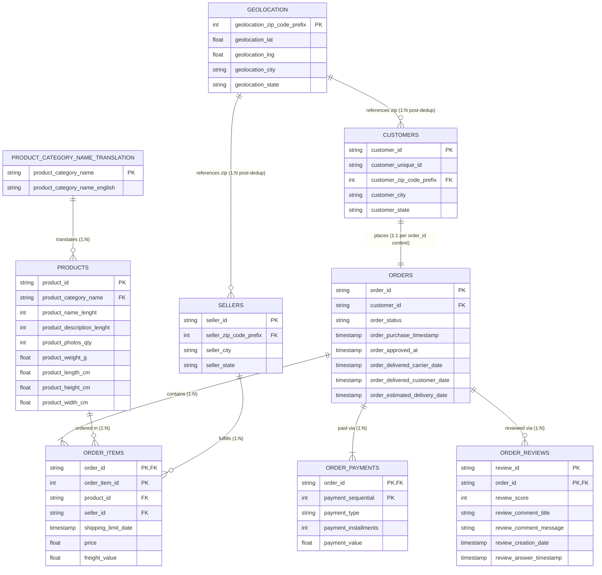

# RetailPulse Schema Analysis & Relational Model Specification

## Executive Summary
This document provides a comprehensive structural and relational schema analysis for the **RetailPulse** e-commerce dataset (`data/raw/`). The analysis identifies all valid Primary Keys (PK), Foreign Keys (FK), join conditions, entity relationships, cardinalities, referential integrity metrics, and structural data anomalies across all 9 raw datasets without modifying source CSV files or executing SQL pipeline scripts.

The relational architecture follows a **central order-transaction hub model** where `olist_orders_dataset.csv` and its line-item junction table `olist_order_items_dataset.csv` connect customers, sellers, products, payments, reviews, and geolocation reference data.

---

## Entity Relationship Diagram (ERD)

---

## Primary Key (PK) Registry & Candidate Key Analysis

| Table Name | Defined Primary Key | Key Type | Total Rows | Unique Count | Uniqueness % | Validation & Assessment Rationale |
| :--- | :--- | :--- | :---: | :---: | :---: | :--- |
| `olist_customers_dataset.csv` | `customer_id` | Single Column | 99,441 | 99,441 | **100.00%** | `customer_id` is 100% unique per order session. Note: `customer_unique_id` (96,096 unique values) represents the underlying human customer across repeat orders. |
| `olist_geolocation_dataset.csv` | Composite (`geolocation_zip_code_prefix`, `geolocation_lat`, `geolocation_lng`) / Synthetic Surrogate | Composite / Aggregated | 1,000,163 | 720,154 | **72.00%** | Raw table contains **261,831 exact duplicate rows** and multiple lat/lng readings per zip code (19,015 unique zip codes). Requires aggregation/deduplication to form a valid dimension key. |
| `olist_order_items_dataset.csv` | (`order_id`, `order_item_id`) | Composite (2 columns) | 112,650 | 112,650 | **100.00%** | The combination of order ID and sequential item number (1, 2, 3...) is 100% unique (0 duplicate pairs). |
| `olist_order_payments_dataset.csv` | (`order_id`, `payment_sequential`) | Composite (2 columns) | 103,886 | 103,886 | **100.00%** | The pair (`order_id`, `payment_sequential`) uniquely identifies each payment transaction/installment per order. |
| `olist_order_reviews_dataset.csv` | (`review_id`, `order_id`) | Composite (2 columns) | 99,224 | 99,224 | **100.00%** | `review_id` alone has 98,410 unique values because a single review can occasionally be submitted for multi-item orders. The pair (`review_id`, `order_id`) guarantees 100% uniqueness. |
| `olist_orders_dataset.csv` | `order_id` | Single Column | 99,441 | 99,441 | **100.00%** | Central entity primary key; 100% unique with 0 duplicate values. |
| `olist_products_dataset.csv` | `product_id` | Single Column | 32,951 | 32,951 | **100.00%** | Product catalog primary key; 100% unique with 0 duplicate values. |
| `olist_sellers_dataset.csv` | `seller_id` | Single Column | 3,095 | 3,095 | **100.00%** | Seller registry primary key; 100% unique with 0 duplicate values. |
| `product_category_name_translation.csv` | `product_category_name` | Single Column | 71 | 71 | **100.00%** | Language lookup table primary key; 100% unique with 0 duplicate values. |

---

## Foreign Key (FK) & Table Relationship Specifications

### Relationship 1: Customers to Orders Relationship

- **Parent Table (Primary Entity):** `olist_customers_dataset.csv` (`customers`)
- **Parent Key Column:** `customer_id`
- **Child Table (Dependent Entity):** `olist_orders_dataset.csv` (`orders`)
- **Child Foreign Key Column:** `customer_id`
- **Join Condition:** `customers.customer_id = orders.customer_id`
- **Cardinality:** **1-to-1** (Order-Level Session Key) / **1-to-Many** (Human Customer Level)
- **Referential Integrity Match Rate:** `100.00% (99,441 / 99,441 orders matched)`
- **Orphan / Missing Record Breakdown:** 0 orphan orders; 0 unreferenced customers
- **Business & Domain Explanation:** In the raw Olist dataset design, a new `customer_id` is generated for every purchase transaction to capture transaction-specific shipping location details. Therefore, `customers.customer_id` maps 1-to-1 to `orders.customer_id`. However, the `customer_unique_id` column inside `customers` groups repeat orders by the same physical person (96,096 unique humans placed 99,441 orders, with a maximum of 17 orders by a single customer).
- **Data Anomalies & Join Safeguards:** None at `customer_id` level. In analytical models, a master customer dimension should be created using `customer_unique_id`.

---

### Relationship 2: Orders to Order Items Relationship

- **Parent Table (Primary Entity):** `olist_orders_dataset.csv` (`orders`)
- **Parent Key Column:** `order_id`
- **Child Table (Dependent Entity):** `olist_order_items_dataset.csv` (`order_items`)
- **Child Foreign Key Column:** `order_id`
- **Join Condition:** `orders.order_id = order_items.order_id`
- **Cardinality:** **1-to-Many (1:N)**
- **Referential Integrity Match Rate:** `100.00% (112,650 / 112,650 order items matched)`
- **Orphan / Missing Record Breakdown:** 0 orphan order items; 775 orders in `orders` table have no items in `order_items`
- **Business & Domain Explanation:** One order can contain one or multiple line items. The distribution ranges from 1 to 21 items per order (average 1.14 items per order). Out of 99,441 total orders, 98,666 orders have item lines, while 775 orders (0.78%) have 0 item lines (corresponding to canceled or unavailable orders prior to fulfillment).
- **Data Anomalies & Join Safeguards:** Left joins from `orders` to `order_items` will produce null values for 775 non-fulfilled orders.

---

### Relationship 3: Orders to Order Payments Relationship

- **Parent Table (Primary Entity):** `olist_orders_dataset.csv` (`orders`)
- **Parent Key Column:** `order_id`
- **Child Table (Dependent Entity):** `olist_order_payments_dataset.csv` (`order_payments`)
- **Child Foreign Key Column:** `order_id`
- **Join Condition:** `orders.order_id = order_payments.order_id`
- **Cardinality:** **1-to-Many (1:N)**
- **Referential Integrity Match Rate:** `100.00% (103,886 / 103,886 payment records matched)`
- **Orphan / Missing Record Breakdown:** 0 orphan payment records; 1 order in `orders` table has no payment record
- **Business & Domain Explanation:** Customers can pay for an order using multiple payment methods or split payments (e.g. credit card + voucher). Payment sequential number (`payment_sequential`) tracks each payment attempt (ranges from 1 to 29 payment records per order; average 1.04 payments per order).
- **Data Anomalies & Join Safeguards:** Summing `payment_value` across orders requires grouping by `order_id` first to avoid inflating financial totals when joining with `order_items`.

---

### Relationship 4: Orders to Order Reviews Relationship

- **Parent Table (Primary Entity):** `olist_orders_dataset.csv` (`orders`)
- **Parent Key Column:** `order_id`
- **Child Table (Dependent Entity):** `olist_order_reviews_dataset.csv` (`order_reviews`)
- **Child Foreign Key Column:** `order_id`
- **Join Condition:** `orders.order_id = order_reviews.order_id`
- **Cardinality:** **1-to-Many (1:N)**
- **Referential Integrity Match Rate:** `100.00% (99,224 / 99,224 review records matched)`
- **Orphan / Missing Record Breakdown:** 0 orphan review records; 768 orders in `orders` table have no review record
- **Business & Domain Explanation:** Customers submit feedback and star ratings (1-5) for orders. In rare instances, customers submit multiple review entries or survey updates for the same order (ranges from 1 to 3 review records per order; average 1.01). Out of 99,441 orders, 98,673 orders received at least one review.
- **Data Anomalies & Join Safeguards:** Joining `orders` to `order_reviews` can produce slight row multiplication if an order has >1 review entry (555 orders have 2 or 3 reviews).

---

### Relationship 5: Products to Order Items Relationship

- **Parent Table (Primary Entity):** `olist_products_dataset.csv` (`products`)
- **Parent Key Column:** `product_id`
- **Child Table (Dependent Entity):** `olist_order_items_dataset.csv` (`order_items`)
- **Child Foreign Key Column:** `product_id`
- **Join Condition:** `products.product_id = order_items.product_id`
- **Cardinality:** **1-to-Many (1:N)**
- **Referential Integrity Match Rate:** `100.00% (112,650 / 112,650 items matched)`
- **Orphan / Missing Record Breakdown:** 0 orphan items; all 32,951 catalog products appear at least once in `order_items`
- **Business & Domain Explanation:** Connects product catalog metadata (category, weight, dimensions) to line item sales. Each product can be purchased multiple times (ranges from 1 to 527 items per product; average 3.42 items).
- **Data Anomalies & Join Safeguards:** 610 products in the `products` table are missing category names and physical attributes, requiring handling during product dimension enrichment.

---

### Relationship 6: Sellers to Order Items Relationship

- **Parent Table (Primary Entity):** `olist_sellers_dataset.csv` (`sellers`)
- **Parent Key Column:** `seller_id`
- **Child Table (Dependent Entity):** `olist_order_items_dataset.csv` (`order_items`)
- **Child Foreign Key Column:** `seller_id`
- **Join Condition:** `sellers.seller_id = order_items.seller_id`
- **Cardinality:** **1-to-Many (1:N)**
- **Referential Integrity Match Rate:** `100.00% (112,650 / 112,650 items matched)`
- **Orphan / Missing Record Breakdown:** 0 orphan items; all 3,095 registered sellers have at least 1 order item
- **Business & Domain Explanation:** Identifies the marketplace merchant responsible for fulfilling each order line item. Sellers fulfill between 1 and 2,033 items (average 36.4 items per seller).
- **Data Anomalies & Join Safeguards:** An individual order containing multiple items can have items fulfilled by different sellers.

---

### Relationship 7: Product Category Translation to Products Relationship

- **Parent Table (Primary Entity):** `product_category_name_translation.csv` (`translation`)
- **Parent Key Column:** `product_category_name`
- **Child Table (Dependent Entity):** `olist_products_dataset.csv` (`products`)
- **Child Foreign Key Column:** `product_category_name`
- **Join Condition:** `translation.product_category_name = products.product_category_name`
- **Cardinality:** **1-to-Many (1:N)**
- **Referential Integrity Match Rate:** `99.96% of categorized products matched (32,328 / 32,341 categorized products)`
- **Orphan / Missing Record Breakdown:** 13 products across 2 category names (`pc_gamer`: 9 products, `portateis_cozinha_e_preparadores_de_alimentos`: 4 products) missing in translation table; 610 products have null category name
- **Business & Domain Explanation:** Lookup table mapping Portuguese product category names to English translations for reporting and analytics.
- **Data Anomalies & Join Safeguards:** Left join required; 2 Portuguese categories (`pc_gamer`, `portateis_cozinha_e_preparadores_de_alimentos`) are missing from translation table and need explicit fallback handling.

---

### Relationship 8: Geolocation to Customers Relationship

- **Parent Table (Primary Entity):** `olist_geolocation_dataset.csv` (`geolocation`)
- **Parent Key Column:** `geolocation_zip_code_prefix`
- **Child Table (Dependent Entity):** `olist_customers_dataset.csv` (`customers`)
- **Child Foreign Key Column:** `customer_zip_code_prefix`
- **Join Condition:** `geolocation.geolocation_zip_code_prefix = customers.customer_zip_code_prefix`
- **Cardinality:** **1-to-Many (1:N)** (Post-Deduplication / Aggregation)
- **Referential Integrity Match Rate:** `99.72% (99,163 / 99,441 customer rows matched)`
- **Orphan / Missing Record Breakdown:** 278 customer zip code prefixes (278 customers) not present in geolocation dataset
- **Business & Domain Explanation:** Enriches customer addresses with spatial attributes (latitude, longitude, state, city) for geographic analysis.
- **Data Anomalies & Join Safeguards:** **CRITICAL JOIN HAZARD:** Raw `geolocation` table contains multiple coordinate records per zip code prefix (up to 1,146 rows for a single zip prefix). A direct SQL `JOIN` on raw geolocation causes **severe Cartesian row duplication**. The geolocation table MUST be deduplicated/aggregated (e.g. median lat/lng per zip code) prior to joining.

---

### Relationship 9: Geolocation to Sellers Relationship

- **Parent Table (Primary Entity):** `olist_geolocation_dataset.csv` (`geolocation`)
- **Parent Key Column:** `geolocation_zip_code_prefix`
- **Child Table (Dependent Entity):** `olist_sellers_dataset.csv` (`sellers`)
- **Child Foreign Key Column:** `seller_zip_code_prefix`
- **Join Condition:** `geolocation.geolocation_zip_code_prefix = sellers.seller_zip_code_prefix`
- **Cardinality:** **1-to-Many (1:N)** (Post-Deduplication / Aggregation)
- **Referential Integrity Match Rate:** `99.77% (3,088 / 3,095 seller rows matched)`
- **Orphan / Missing Record Breakdown:** 7 seller zip code prefixes (7 sellers) not present in geolocation dataset
- **Business & Domain Explanation:** Enriches seller locations with spatial coordinates for logistics and freight distance calculations.
- **Data Anomalies & Join Safeguards:** Same Cartesian duplication risk as customer join; requires aggregated 1-to-1 zip code lookup table.

---

## Junction Tables & Composite Many-to-Many (M:N) Relationships

### 1. Orders to Products (`orders` ↔ `products`)
- **Junction Table:** `olist_order_items_dataset.csv` (`order_items`)
- **Left Parent:** `olist_orders_dataset.csv` (`order_id`)
- **Right Parent:** `olist_products_dataset.csv` (`product_id`)
- **Cardinality:** **Many-to-Many (M:N)**
- **Explanation:** An order can contain multiple distinct products, and a single product can be purchased across thousands of different orders. The `order_items` table acts as the associative entity holding item price (`price`), freight cost (`freight_value`), shipping deadline (`shipping_limit_date`), and item sequence (`order_item_id`).

### 2. Orders to Sellers (`orders` ↔ `sellers`)
- **Junction Table:** `olist_order_items_dataset.csv` (`order_items`)
- **Left Parent:** `olist_orders_dataset.csv` (`order_id`)
- **Right Parent:** `olist_sellers_dataset.csv` (`seller_id`)
- **Cardinality:** **Many-to-Many (M:N)**
- **Explanation:** Orders on Olist can be fulfilled by multiple independent merchants. A single multi-item order can contain products shipped by different sellers, and each seller fulfills items for multiple customer orders.

### 3. Human Customers to Sellers (`customer_unique_id` ↔ `sellers`)
- **Intermediate Entities:** `customers` → `orders` → `order_items` → `sellers`
- **Cardinality:** **Many-to-Many (M:N)**
- **Explanation:** Links repeat human buyers (`customer_unique_id`) to merchants over time for customer loyalty and marketplace seller analysis.

---

## Summary of Join Safeguards & Data Engineering Constraints

1. **Pre-Join Deduplication for Geolocation:** Never join raw `olist_geolocation_dataset.csv` directly to `customers` or `sellers` on `zip_code_prefix` without aggregating coordinates first (e.g., `GROUP BY geolocation_zip_code_prefix` selecting `AVG(lat)` and `AVG(lng)`).
2. **Fan-Out Prevention on Order Aggregations:** Joining `orders` to both `order_items` and `order_payments` in a single un-aggregated SQL query creates a double fan-out product, miscalculating total payment values and order item revenue. Aggregations must be executed in separate subqueries or CTEs.
3. **Category Translation Fallback:** Always perform a `LEFT JOIN` from `products` to `product_category_name_translation` and use `COALESCE(translation.product_category_name_english, products.product_category_name, 'Unknown')` to prevent loss of products with missing or untranslated categories.
4. **Handling Null Timestamps:** 2,965 orders lack delivery timestamps (`order_delivered_customer_date`). Any delivery SLA metrics must filter on `order_status = 'delivered'` or account for NULL values.